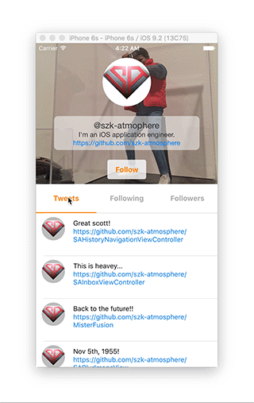

# MartyJunior

[](https://travis-ci.org/Taiki Suzuki/MartyJunior)
[](http://cocoapods.org/pods/MartyJunior)
[](http://cocoapods.org/pods/MartyJunior)
[](http://cocoapods.org/pods/MartyJunior)




You can change tab contents with swipe gesture on middle of `UITableView`!!

## Features

- [x] Change tab middle of `UITableView`.
- [x] Be able to scroll smoothly without two step.
- [x] Auto fill content space when content size is not enough.
- [x] Flexible and customizable top content.
- [x] Customizable tab view.
- [x] Navigation view.

## Installation

MartyJunior is available through [CocoaPods](http://cocoapods.org). To install
it, simply add the following line to your Podfile:

```ruby
  pod "MartyJunior"
```

## Usage

If you install from cocoapods, You have to write `import MartyJunior`.

### Life cycle

`viweDidLoad` -> `viewWillSetupForMartyJunior` -> `viewDidSetupForMartyJunior`

You have to setup `delegate`, `dataSource` and so on in `viewWillSetupForMartyJunior` like this.

```swift
override func viewWillSetupForMartyJunior() {
    super.viewWillSetupForMartyJunior()
    delegate = self
    dataSource = self
    registerNibToAllTableViews(ProfileTweetCell.Nib, forCellReuseIdentifier: ProfileTweetCell.ReuseIdentifier)
    registerNibToAllTableViews(ProfileUserCell.Nib, forCellReuseIdentifier: ProfileUserCell.ReuseIdentifier)

    tabView.delegate = self

    title = "@szk-atmosphere"
}
```

You have to setup `NavigationView` and so on in `viewDidSetupForMartyJunior` like this.

```swift
override func viewDidSetupForMartyJunior() {
    super.viewDidSetupForMartyJunior()
    navigationView?.titleLabel.alpha = 0
    navigationView?.rightButton = UIButton(type: .InfoDark)
    navigationView?.rightButton?.tintColor = .whiteColor()
}
```

### Specific dataSource methods

```swift
// Return number of tabs
func mjViewControllerNumberOfTabs(viewController: MJViewController) -> Int

// Return UIView you want to display as top content
func mjViewControllerContentViewForTop(viewController: MJViewController) -> UIView

// Return TabView if you want to display as custom view
optional func mjViewControllerTabViewForTop(viewController: MJViewController) -> UIView
```

### Other dataSource methods

Protocol based on `UITableViewDataSource`. It has `targetIndex` parameter to assign applicable `tableView`.

- Example
```swift
optional func mjViewController(viewController: MJViewController, targetIndex: Int, numberOfSectionsInTableView tableView: UITableView) -> Int
```

### Specific delegate methods

```swift
// Celled when selected tab index was changed
optional func mjViewController(viewController: MJViewController, didChangeSelectedIndex selectedIndex: Int)
```

### Other delegate methods

Protocol based on `UITableViewDelegate`. It has `targetIndex` or `selectedIndex` parameter to assign applicable `tableView`.

- Example
```swift
optional func mjViewController(viewController: MJViewController, targetIndex: Int, tableView: UITableView, didSelectRowAtIndexPath indexPath: NSIndexPath)
optional func mjViewController(viewController: MJViewController, selectedIndex: Int, scrollViewDidScroll scrollView: UIScrollView)
```

## Requirements
- Xcode 7 or greater
- iOS 8.0 or greater
- [MisterFusion](https://github.com/szk-atmosphere/MisterFusion) (Swift DSL for AutoLayout)
- UIKit

## Other

[A sample of this project](./MartyJuniorSample) uses

- [SABlurImageView](https://github.com/szk-atmosphere/SABlurImageView) (for animation blur)
- [ReuseCellConfigure](https://github.com/szk-atmosphere/ReuseCellConfigure) (for cell configuration)

## Author

Taiki Suzuki, s1180183@gmail.com

## License

MartyJunior is available under the MIT license. See the LICENSE file for more info.
